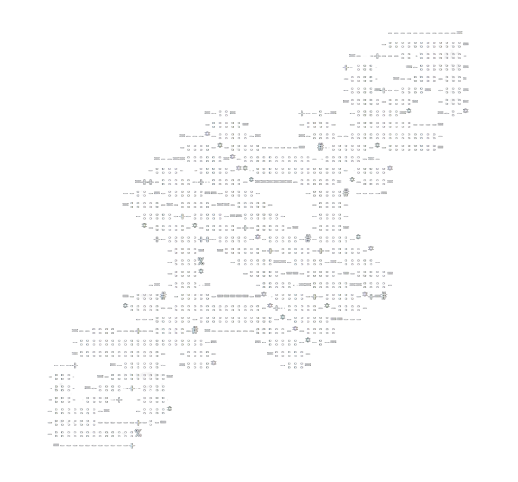

☆★☆★☆★☆★☆★☆★☆★☆★☆★☆★☆★☆★

### ✦ 𝐖𝐞𝐛 𝐁𝐮𝐢𝐥𝐝 𝐊𝐢𝐭 ✦ 

**Description**  This is my Web Build Kit where I keep code pieces I want to use frequently. My code is free to copy,
or change. Any art uploaded here is free to use. For easy navigation, open the [Index.html](Index.html) !

﹌﹌﹌﹌﹌﹌﹌  **Basics** 

> This is where I keep my blank html set up. My colour pallet. My backgrounds, buttons, and fonts.

**Eyeball** 

> A cute eyeball crystal ball that follows your mouse around the screen.

**Games** 

> Different game code snippets that I want to keep are in here. Built up over projects.

**Loading Screen** 

> My Hayleyien loading screen built for webpages.

**Assets** 

> Free graphics I have created are found in here.

﹌﹌﹌﹌﹌﹌﹌  **About the Author**  My strange little slice of life. I love art, of all kinds. Especially 3D
modeling, graphics, and design. Programs used are Blender, Canva, Godot, Pheonix Code, and VSCode. I get my fonts from
Google Fonts. My jam is interactive projects, where I experiement with layered art to make a digital environment come to
life.

**Links**

-   YouTube: [My Videos](https://www.youtube.com/@Hayleyien)
-   Pinterest: [My Boards](https://ca.pinterest.com/hayleyien/)
-   Website: [My Site](https://hayleyien.ca/)
-   Itch.io: [My Stuff](https://hayleyien.itch.io/)
-   Imgur: [Extra Images](https://imgur.com/user/Hayleyien/)

**ℌ𝒶𝓎𝓁𝑒𝓎𝒾𝑒𝓃**

☆★☆★☆★☆★☆★☆★☆★☆★☆★☆★☆★☆★

